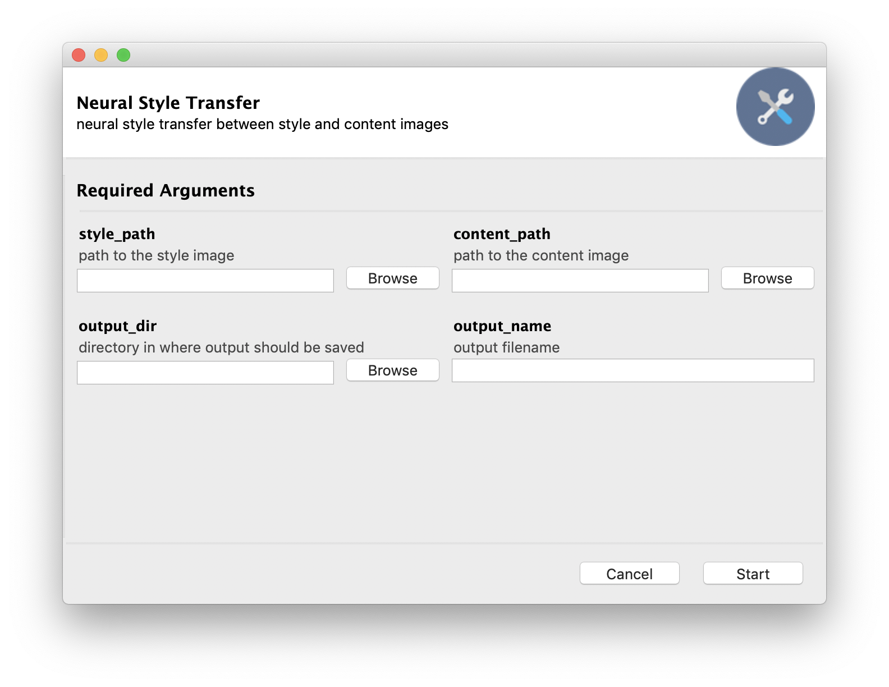

# Neural Style Transfer
Neural Style Transfer Implementation in PyTorch

## Implementation
- We define two distances (one measuring the difference in content between two images, another measuring the difference in style). We create a new image that minimises the content distance to the content image and the style distance to the style image. 
- Original paper: [pdf](https://arxiv.org/abs/1508.06576)

## Instructions
### Environment
Set up the environment:
```bash
python -m venv .venv/neural-style-transfer
source .venv/neural-style-transfer/bin/activate
pip install -r requirements.txt
```

### CLI
Run the script through the following command:
```bash
python main.py --style_path [S_PATH] --content_path [C_PATH] --output_dir [O_DIR] --output_name [O_NAME]
```
### GUI
The GUI version can be run with the following:
```bash
pythonw main_gui.py
```

Arguments can then be inputted in the interface:
